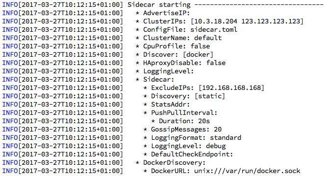

Rubberneck
==========

[](http://godoc.org/github.com/relistan/rubberneck)

Pretty(ish) print configuration output on application startup! Make it easy
to see what those env vars actually told your app to do!



The Problem
-----------

Modern applications are often configured from environment variables, or from a
combination of environment variables and command line flags, or config files.
Environment variables are great and they're recommended by everthing from [The
Twelve-Factor App](https://12factor.net/config) to modern container engines.

This is good stuff. But there are a couple of challenges:

1. They make it very easy to think you're configuring your app while
accidentally leaving out critial settings, or misspelling a variable, or
putting an extra `_` where it wasn't needed. This can make debugging
problematic.

2. Discoverability is a challenge. One nice thing about config files is that
they make it easy to see all the possible configuration settings in one place.
You can ship your app with a default configuration with lots of comments in it
and users can easily discover which settings to provide. If you configure your
app with env vars, you have to put this all into the documentation (always a good idea, anyway),
but you lose the direct tie between the code and the docs. That means it's
easy to have settings that aren't in the docs.

A Solution
----------

In Go, configuration is usually stored in a struct or nested struct. This makes
using systems like [envconfig](https://github.com/kelseyhightower/envconfig) or
[Kingpin](https://github.com/alecthomas/kingpin) really easy. Having the configuration
collected all together presents a possible soltuion:

**One possibility is to print out your application's configuration on startup.
Once all the configuration has been generated, all CLI flags applied, dump the struct
to the stdout of the application so that we can see not just what env vars were passed,
but what the configuration was that was actually generated inside the application.**

You could do this in a lot of ways. This is for humans and humans don't read
JSON easily, but you could still dump a TOML or YAML file, for example. But the
output won't nest easily into your logging system, for example. So Rubberneck
tries to solve that in a really simple way.

Usage
-----

The most basic usage is:

```go
	rubberneck.Print(myConfigStruct)
```

This will dump the output to stdout using the `fmt` package and will look something
like:

```
Settings -----------------------------------------
  * AdvertiseIP: 192.168.168.168
  * ClusterIPs: [10.3.18.204 123.123.123.123]
  * ConfigFile: sidecar.toml
  * ClusterName: default
  * CpuProfile: false
  * Discover: [docker static]
  * HAproxyDisable: false
  * LoggingLevel:
  * Sidecar:
    * ExcludeIPs: [192.168.168.168]
    * StatsAddr:
    * PushPullInterval:
      * Duration: 20s
    * GossipMessages: 20
    * LoggingFormat: standard
    * LoggingLevel: debug
    * DefaultCheckEndpoint:
  * DockerDiscovery:
	* DockerURL: unix:///var/run/docker.sock
--------------------------------------------------
```

If you want to instead print to the `logrus` package you could do is like this:

```go
    printer := rubberneck.NewPrinter(log.Infof, rubberneck.NoAddLineFeed)
    printer.Print(opts)
```

If you wanted to provide a custom label at the top, and to print out more than
one struct you could do something like this:

```go
    printer := rubberneck.NewPrinter(log.Infof, rubberneck.NoAddLineFeed)
    printer.PrintWithLabel("Sidecar starting", *opts, config)
```

This will result in the "Settings" block above being titled liked:

```
INFO[001] Sidecar starting ---------------------------------
INFO[001]   * AdvertiseIP: 192.168.168.168
INFO[001]   * ClusterIPs: [10.3.18.204 123.123.123.123]
INFO[001]   * ConfigFile: sidecar.toml
```

How to handle output is highly configurable because Rubberneck just takes a
function as the output argument. The function must be of the following definition:

```go
type printerFunc func(format string, v ...interface{})
```

The various logrus functions conform to this as do those of various other
packages. If yours doesn't, or you want to do something else with the output,
you can pass an anonymous function that does what you need.

Caveats
-------

This is for printing *configuration* structs, usually derived from environment
variable configurations or CLI flags, and therefore does not attempt to handle
all possible structures. It assumes that you don't have anything but basic
types inside of slices, for example. This is generally what you want. If it's
not, then you might be better off dumping out YAML or something more complex.

Contributing
------------

Contributions are more than welcome. Bug reports with specific reproduction
steps are great. If you have a code contribution you'd like to make, open a
pull request with suggested code.

Pull requests should:

 * Clearly state their intent in the title
 * Have a description that explains the need for the changes
 * Include tests!
 * Not break the public API

Ping us to let us know you're working on something interesting by opening a
GitHub Issue on the project.
